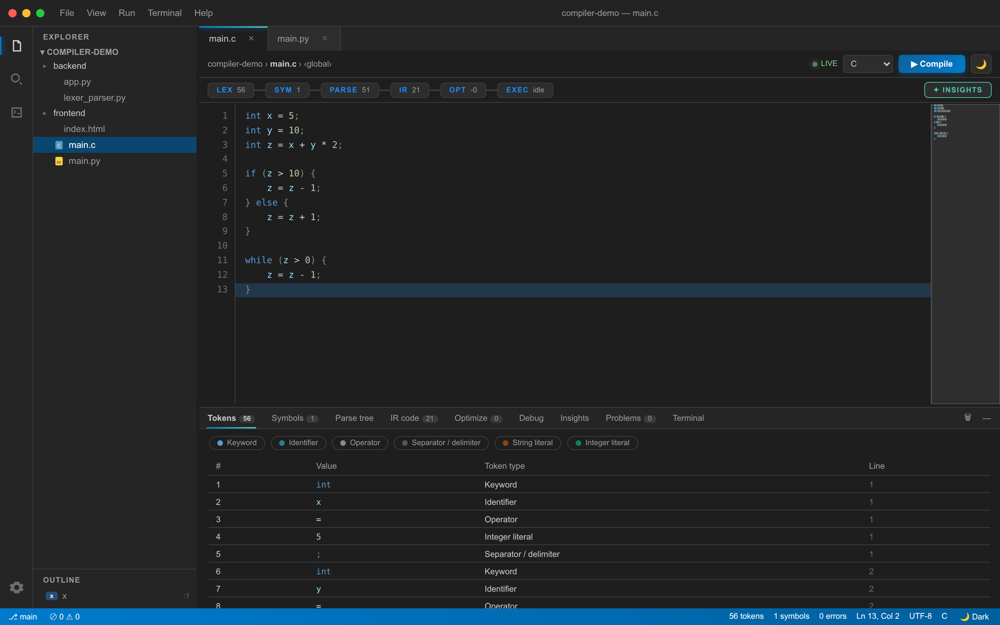
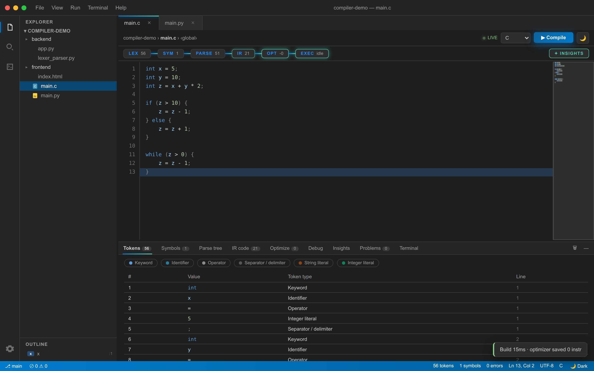

<div align="center">

# ⚡ CompileViz IDE

### The VS Code–style Compiler-Construction Visualizer — C & Python, 4 phases, real execution

**Watch your code compile in the browser.** Lexical → Syntax → Semantic → Intermediate Code (IR), plus a real `gcc`/`python3` **terminal** that actually runs your programs — all inside a polished, single-page IDE.

`Python 3.12` · `Flask` · `Lex/Yacc/GCC` · `JavaScript · Vite` · `Playwright`

---





</div>

---

## ✨ What is CompileViz?

CompileViz is a **production-ready, browser-based IDE** for learning compiler construction. Paste a real **C** or **Python** program and watch the entire compilation pipeline run end‑to‑end — with every phase visualized, categorized, and explained — then **execute** it in a real terminal.

It is built for **university classrooms**: output is canonical, deterministic, and accurate **within a bounded, testable language subset**, so students learn the textbook pipeline — not a black box.

| | |
|---|---|
| 🔤 **Lexical Analysis** | Every lexeme as a real token, fully classified: `DATATYPE int · IDENTIFIER x · OPERATOR = · NUMBER 5 · DELIMITER ;` — with a live token count. |
| 🌳 **Syntax Analysis** | A proper derivation tree of the grammar, collapsible in the panel. |
| 🔍 **Semantic Analysis** | Categorized symbol table (DATATYPE / KEYWORD / OPERATOR / DELIMITER / VARIABLE / FUNCTION / CONSTANT), declaration & type checks, exact line·col diagnostics. |
| ⚙️ **IR Generation** | Canonical three-address code with explicit temporaries, labels, and control flow. |
| 💻 **Real Execution** | A VS Code–grade **terminal** that really runs your code: `gcc -Wall` for C, `python3` for Python — output, exit codes, errors in red. |
| ⚡ **Instant Feedback** | Tokens, symbols, IR, parse tree, problems & insights all update the moment you hit **Run Compiler**. |

---

## 🚀 Quickstart (2 minutes)

### 0. Prerequisites

- **Python 3.12+**
- **Node.js 24 +** (for the Vite build + Playwright tests)
- **C toolchain** for the native compiler: `flex`, `bison/yacc`, `gcc`

### 1. One-shot reproducible setup

```bash
make setup          # venv + pip deps + npm deps (everything you need)
make                # build the C compiler binary → compiler/compiler
```

### 2. Run it

```bash
make run            # dev server → open http://localhost:5000
# or production (Waitress, debug off):
make run-prod
```

Then in the IDE: pick a sample from the explorer → **▶ Run Compiler** to visualize the 4 phases, or **▶ Execute** to really compile & run it in the terminal.

> 💡 **New here?** Read the **[Complete Project Guide](docs/GUIDE.md)** — it maps every file/folder
> in the repo, explains what each piece does, and shows how to run, test, and demo everything.
> For the full **[Software Requirements Specification](docs/SRS.md)** (requirements, scope,
> contracts, subset, success criteria, test plan), see `docs/SRS.md`.

---

## 💻 Terminal Commands

Type these in the **TERMINAL** tab:

```text
help            list all commands
compile         run the 4-phase in-browser compiler
run             compile & run — real gcc/python3 via backend, VM fallback
step            single-step the VM in the Debug tab (breakpoints)
tokens          print the token stream
symbols         print the symbol table
ir              print the three-address IR
opt             print optimizer transformations
outline         print functions + line numbers
ls              list files
cat <file>      show a file's raw source
echo <text>     echo text
theme           toggle light/dark
backend         probe the real Flask compiler (tokens/IR/errors via /api/compile)
neofetch        about this IDE
clear           clear the terminal
```

---

## 🧭 Features

- **Full 4-phase visualization** for C (Lex/Yacc/GCC) and Python (stdlib `tokenize` + `ast`) — identical output schema across both languages.
- **Classic compiler output**: real token stream (`CLASS / LEXEME / LINE`), categorized symbol table, derivation tree, three-address IR.
- **VS Code–grade IDE**: activity bar, file explorer, syntax-highlighted editor, bottom + side panels, status bar, light/dark theme, command palette (`Ctrl+Shift+P`).
- **Resizable panels**: drag the border handles to resize the explorer, side, and bottom panels.
- **Real execution terminal**: gcc compilation with real diagnostics, program output, exit codes, command history, maximize, clear.
- **Fully local & deterministic**: syntax highlighting and autocomplete run in the browser — zero network.
- **Handles failure gracefully**: out-of-subset code produces a clear diagnostic, never a silent miscompile.

---

## 🏗️ Architecture

**Hybrid engine.** The browser carries its own complete compiler (lexer → parser → type checker →
IR → optimizer → step-debuggable VM) that renders every panel instantly and offline. The Flask
backend hosts the *real* native pipeline and real code execution; when reachable, `Run` uses genuine
`gcc`/`python3` and `backend` surfaces the real compiler's IR/errors, with automatic fallback so
nothing breaks offline.

```
┌────────────────────────────────────────────────────────────────────────────┐
│                        BROWSER  (single-file IDE)                          │
│   PRIMARY ENGINE (in-browser JS, always-on):                               │
│   tokenize → buildSym → parse → typeCheck → genIR → optimize → makeVM     │
│   editor · panels(tokens/symbols/parse/ir/opt/debug/insights) · terminal  │
└───────────────────────────────────┬───────────────────────────────────────┘
                                    │  HTTP (JSON) — best-effort, offline-safe
┌───────────────────────────────────▼───────────────────────────────────────┐
│                       Flask BACKEND  (Python)                backend/     │
│   /api/status · /api/run · /api/compile · /api/tokenize                  │
│   lexer_parser · tree_builder · python_analyzer · code_runner            │
└───────────────────────────────────┬───────────────────────────────────────┘
                                    │  stdin → stdout (bounded, timed)
┌───────────────────────────────────▼───────────────────────────────────────┐
│                       NATIVE COMPILER  (Lex/Yacc/GCC)      compiler/      │
│   lexer.l + parser.y  →  PHASE 0–4 text output                             │
└────────────────────────────────────────────────────────────────────────────┘
```

**One canonical schema for both languages:**

```json
{ "success", "language", "tokens", "parse_tree", "symbol_table",
  "ir_code", "errors", "warnings", "phases", "raw_output" }
```

**Security posture** (submitted code is untrusted): 10 s timeout · resource/address-space caps · 1 MB output cap · isolated temp dirs with cleanup · **no shell interpolation** · CORS allowlist · security headers · concurrency guard · request-body bound.

---

## 🧪 Testing

```bash
make test          # pytest (backend) + Playwright E2E (build → serve → browser)
make lint          # ruff check (backend)
make check         # lint + test
```

- **Backend** — 60 pytest tests: pipeline goldens, precedence/associativity, semantic errors, subset boundary, output fidelity, schema parity, security hardening, catalog gate, Python type-hinting.
- **E2E** — 14 Playwright tests in a real Chromium: every sample compiles, every tab/button/toggle, resizable panels, token count, real C & Python execution in the terminal, resizable panels, SC-010 (all phases render < 2 s).
- **CI (GitHub Actions)** runs `make test` on push/PR from a clean bootstrap.

---

## 📦 Supported Language Subset

C and Python support is defined by an accuracy contract: a sample is **valid iff inside the subset**; every out-of-subset construct must produce a **clear diagnostic — never a silent miscompile**.

- **C:** `int/char/float`, arithmetic (`+ - * / %`), relational & logical, `if/else`, `for`, `while`, `do-while`, `return`, `printf`/`scanf` (fixed forms), optional headers, comments with correct line tracking, C-standard precedence/associativity.
- **Python:** functions, `if/elif/else`, `while`, `for … in`, `break`/`continue`, `import`, `print`, arithmetic/comparison/logical operators — plus optional **type hints** (`def f(x: int) -> str:`, `x: int = 5`) that parse and analyze without crashing.

---

## 📁 Project Structure — Every File Explained

### Repository layout

```
Project-Compiler/
├── Makefile                 # build/test/run — the single source of truth
├── README.md                # this file
├── LICENSE
├── docs/                   # README screenshots + Complete Project Guide
│   ├─ screenshot-app.png
│   ├─ screenshot-compiled.png
│   └─ GUIDE.md            # full file-by-file tour + how to run/test/demo
│   └─ SRS.md              # full Software Requirements Specification (IEEE-style)
├── index.html              # the single-file IDE (source ≈ index121.html)
├── index121.html           # authored/master single-file IDE (byte-identical)
├── backend/                # Flask JSON API + pipelines + tests
│   ├─ app.py              # Flask routes: /api/compile · /api/run · /api/tokenize · /api/status
│   ├─ compiler_runner.py  # safely shells out to the native compiler (stdin → stdout)
│   ├─ code_runner.py      # real gcc / python3 execution in the terminal
│   ├─ lexer_parser.py     # parse raw compiler text → structured tokens/symbols/IR
│   ├─ tree_builder.py     # build the derivation tree
│   ├─ python_analyzer.py  # Python pipeline (stdlib tokenize + ast) — same schema
│   ├─ contract.py         # shared response contracts + language const
│   ├─ wsgi.py             # production entrypoint (Waitress)
│   ├─ requirements.txt
│   ├─ README.md           # backend API + endpoints + files + tests
│   └─ tests/             # 60 pytest tests
├─ compiler/               # the real native flex/bison C compiler
│   ├─ lexer.l             # Lexical specification → tokenizer
│   ├─ parser.y            # Yacc/Bison grammar → parser (PHASE 0–4 output)
│   ├─ Part 1 … Part 6/    # step-by-step build tutorial folders
│   ├─ Images/             # grammar, symbol-table & tree diagrams
│   ├─ archive/            # iterative parser experiments (v1–v8)
│   └─ Makefile            # builds compiler/compiler
└─ frontend/
   ├─ index.html          # single-file IDE (copied into dist/ by Vite)
   ├─ alive_audit.mjs     # live compile+run audit (C/Python + pseudo-C fallback)
   ├─ deep_audit.mjs      # deep feature audit (search/outline/minimap/debugger/problems)
   ├─ feat_audit.mjs      # feature audit (menus, commands, theme, palette, panels)
   ├─ README.md           # frontend build/dev/test reference
   ├─ e2e/                 # Playwright specs (14)
   ├─ package.json         # minimal: Vite (build) + Playwright (tests)
   └─ vite.config.ts       # outDir dist/ — Flask serves dist/index.html
```

### Typical daily commands

```bash
make help        # every target, all in one place
make test        # full suite: backend pytest + Playwright E2E
make run         # start the dev server → http://localhost:5000
```

---

## 🖥️ Working in VS Code

Open this repo in VS Code:

1. `File → Open Folder…` → select this repository.
2. **Frontend:** open `index.html` (or `frontend/index.html`) to read the single-file IDE.
3. **Backend:** open `backend/app.py` and `backend/tests/` to read and test the API.
4. **Run it:** open the integrated terminal (`Ctrl+Shift+\``) and run `make run`, then open http://localhost:5000.
5. **Test it:** run `make test` — backend pytest + Playwright E2E both execute from one command.

---

## 🤝 Contributing

1. **The `compiler/Makefile` recipe is authoritative** — `lex lexer.l; yacc -d -v parser.y; gcc -w -o compiler y.tab.c` (no `-ll`; it links `libl`'s `main` and fails). The binary reads source from **stdin**.
2. Edit the single-file IDE in **`frontend/index.html`**, then sync all byte-identical copies — `index.html`, `index121.html`, and `frontend/dist/index.html` (e.g. `cp frontend/index.html index.html index121.html frontend/dist/index.html`). Run `cd frontend && npm run build` to refresh `frontend/dist/`.
3. Run `make test` before pushing — all suites must be green. Quick live checks: `node frontend/alive_audit.mjs`, `node frontend/feat_audit.mjs`, `node frontend/deep_audit.mjs` (against `localhost:5000`).

---

## 📄 License

See [`compiler/LICENSE`](compiler/LICENSE).

<div align="center"><sub>Built with the Spec-Driven Development workflow — every exchange recorded in <code>history/prompts/</code>.</sub></div>